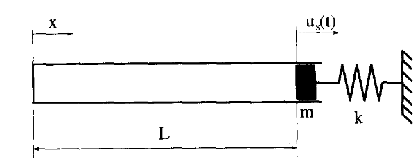

# 1D piston-spring system

An educational code to demonstrate solving a simple Fluid-Structure Interaction problem. The whole domain consist of a compressible inviscid air in a piston as the fluid part and a mass-spring system as the structure part.

  

